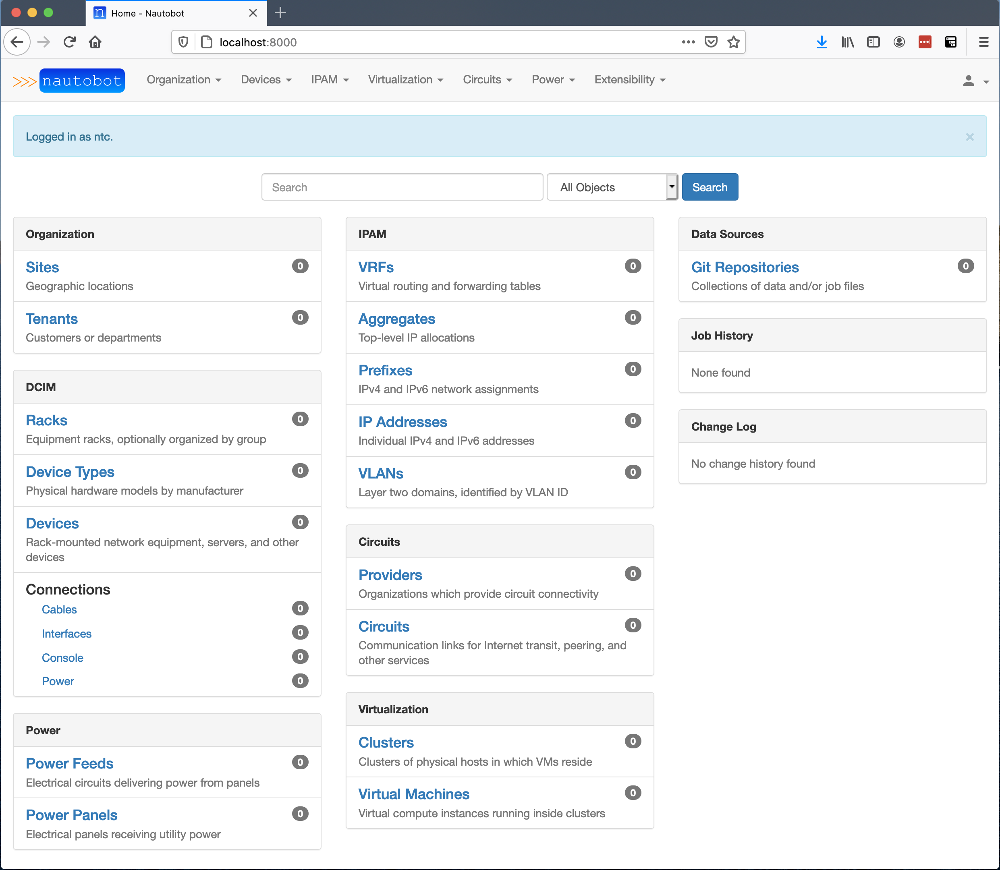

# Nautobot Lab

> This container is **not** for production use!

`Nautobot Lab` is an all-in-one Docker container that allows a user to quickly get an instance of Nautobot up and running with minimal effort.

This image is for the purposes of "kicking the tires" of Nautobot. Utilize `nautobot-lab` to quickly see if Nautobot is right for you and your organization.

It bears repeating, `nautobot-lab` is **NOT a ready for production container**. If you wish to use Nautobot in production, please refer to the [Nautobot documentation](https://nautobot.readthedocs.io/en/latest/installation/).

## Running from Docker Hub

Building the container yourself isn't needed to get up and running quickly. The image is hosted on Docker Hub for public consumption, and you can download and start it with a single command.

```shell
docker run -itd --name nautobot -p 8000:8000 networktocode/nautobot-lab
```

> If you've previously run `nautobot-lab` in the past, you may wish to first invoke `docker pull networktocode/nautobot-lab` to ensure that you have the latest version of this image!

Because this image is an all-in-one container (with Nautobot, PostgreSQL, and Redis), it will take a few seconds to download the container, and then about 30 seconds more for all of the services to start and stabilize. Once the container has started and all services have stabilized, the web interface can be accessed via `http://localhost:8000`.

If you wish, you can also check the health status of the container by running the following command:

```shell
docker ps | grep nautobot
```

You are waiting for the container to be in a `healthy` state as shown below.

```text
99c9312e0409   networktocode/nautobot-lab     "/usr/local/bin/supe…"   3 minutes ago   Up 3 minutes (healthy)   0.0.0.0:8000->8000/tcp, :::8000->8000/tcp
```

Once Nautobot Lab is up and running, you will need to [create a Super User as shown in the section below](#Creating-a-Super-User).

## Building the container

The container can be built locally, if preferred.

1.  Clone the repository.

    ```shell
    git clone https://github.com/nautobot/nautobot-lab.git
    ```

2.  Enter the `nautobot-lab` directory.
3.  Build the image.

    ```shell
    docker build -t nautobot-lab:latest .
    ```

### Running the container from a local build

```shell
docker run -itd --name nautobot -p 8000:8000 nautobot-lab
```

### Importing the demo dataset

The nautobot-lab container provides demo dataset similar to the Nautobot public sandbox (http://demo.nautobot.com).
This dataset can be used to quickly populate your Nautobot instance with the real life data! You can use it to view data, experiment or perform experimental or development work.

Use following command to import the data into your lab container:
```shell
docker exec -itd nautobot load-mock-data
```

!!! warning
    **Importing dataset will erase your existing data**. Issuing the `load-mock-data` will result in destroying your existing dataset and importing new one.
    **Dataset contains default credentials**. If you decide to import provided dataset, the dataset credentials will be used: username: `admin`, password: `admin`.

## The Default Account

The nautobot-lab container comes with a user pre-defined. The username is `demo` and its corresponding password is `nautobot`. If you choose to build your own container, you can define your own attributes for the default account by setting the following environment variables before executing the  `docker build` command.

* NAUTOBOT_USERNAME
* NAUTOBOT_EMAIL
* NAUTOBOT_PASSWORD
* NAUTOBOT_TOKEN

## Creating a Super User

Once the container has started and all the services have stabilized, you can create a Super User account to start exploring Nautobot. The `nautobot-server createsuperuser` command will prompt you for a username, email address, and password. The email address is unused in this particular workflow and can be left blank.

```shell
% docker exec -it nautobot nautobot-server createsuperuser
Username (leave blank to use 'root'): ntc
Email address: info@networktocode.com
Password:
Password (again):
Superuser created successfully.
```

## Installed Applications

The Nautobot Lab container comes with the following applications pre-installed:
* [Device Onboarding](https://docs.nautobot.com/projects/device-onboarding/en/latest/user/app_overview/)
* [Circuit Maintenance](https://docs.nautobot.com/projects/circuit-maintenance/en/latest/user/app_overview/)
* [Data Validation](https://docs.nautobot.com/projects/data-validation/en/latest/user/app_overview/)
* [Capacity Metrics](https://github.com/nautobot/nautobot-plugin-capacity-metrics)
* [Golden Config](https://docs.nautobot.com/projects/golden-config/en/latest/user/app_overview/)
* [Nornir](https://docs.nautobot.com/projects/plugin-nornir/en/latest/user/app_overview/)
* [Nautobot SSoT](https://docs.nautobot.com/projects/ssot/en/latest/user/app_overview/)
* [Device Cycle Lifecycle Management](https://docs.nautobot.com/projects/device-lifecycle/en/latest/user/app_overview/)
* [Firewall Models](https://docs.nautobot.com/projects/firewall-models/en/latest/user/app_overview/)
* [BGP Models](https://docs.nautobot.com/projects/bgp-models/en/latest/user/app_overview/)
* [Welcome Wizard](https://docs.nautobot.com/projects/welcome-wizard/en/latest/user/app_overview/)
* [Floorplan](https://docs.nautobot.com/projects/floor-plan/en/latest/user/app_overview/)
* [Design Builder](https://docs.nautobot.com/projects/design-builder/en/latest/user/app_overview/)

These applications can give you a sense of what is possible with Nautobot as a network automation platform and can assist you with populating the lab environment with data that is unique to you. For the applications that require access to network devices, you can set the `NAPALM_USERNAME` AND `NAPALM_PASSWORD` environment variables when starting the container.

```shell
docker run -itd --name nautobot -p 8000:8000 --env NAPALM_USERNAME="demouser" --env NAPALM_PASSWORD="demopass" networktocode/nautobot-lab:latest
```

## Kick the Tires

At this point, Nautobot can be accessed at `http://localhost:8000` with the user credentials that were created.

Explore, test, create, destroy, do whatever you like in this lab instance of Nautobot.

If you have any questions, don't hesitate to reach out in the #Nautobot channel on the [Network To Code Slack instance](https://networktocode.slack.com), we'll be happy to assist you!

If you're not a member, you can join the Slack instance [here](http://slack.networktocode.com/).


